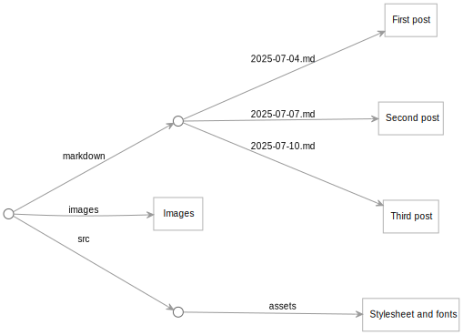

This project shows a sample blog written in [Origami](https://weborigami.org) language.

[View the sample blog](https://pondlife.netlify.app)

This sample blog is based on the [origami-blog-start](https://github.com/WebOrigami/origami-blog-start) project. If you'd like to start your own blog like this, you can fork that project.

The text for this sample blog is adapted from portions of [Walden](https://www.gutenberg.org/files/205/205-h/205-h.htm) by Henry David Thoreau.

## Structure of the site

The site's starting point are the markdown files in the `markdown` folder, the images in the `images` folder, and the stylesheet and other files in the `src/assets` folder.



The [site.ori](src/site.ori) file orchestrates the transformation of that content into the final tree of resources for the site:


- A series of transformations turns each markdown post into an HTML page in the `posts` area.
- Posts are grouped into pages of 10 posts each in the `pages` area.
- The index page shows the same content as `pages/1.html`.
- Feeds are created for the posts in RSS and JSON Feed format.

## Processing markdown posts into data

The posts are written in markdown files with a `title` property in front matter. A short pipeline at the start of `site.ori` transforms those files into a form that's ready for the templates to render as HTML.

Documents in Origami are generally represented as a plain JavaScript objects with a `@text` property containing the document text. Each of the functions in the pipeline manipulates the collection of posts, changing either the keys (names) or values (the actual data) of the posts one step at a time.

The Origami source for the pipeline is:

```
data = markdown
  → @mapFn(@mdHtml)
  → @mapFn((post, fileName) => @merge(post, {
    date: parseDate.ori(fileName)
  }))
  → @addNextPrevious
  → @reverse
```

The pipeline starts with a reference to `markdown`. In this project, that ends up referring to the `markdown` folder at the top level of the project. Origami treats folder/file trees and objects the same, so if we were to render the post data at this point in YAML it would look like:

```
2025-07-04.md:
  title: Hello from the pond!
  @text: **Hey everyone!** Welcome to my very first blog post…
2025-07-07.md:
  title: Tiny home
  @text: When I first decided to move off-grid…
… more posts …
```

The next line, `→ @mapFn(@mdHtml)` sends the above to a built-in mapping function called [@mapFn](https://weborigami.org/builtins/@map.html). Here that will apply the built-in [@mdHtml](https://weborigami.org/builtins/@map.html) to each of the keys and values in the set. That will change the `.md` extension in the keys to `.html`, and change the markdown text to HTML. After this step, the post data is:

```
2025-07-04.html:
  title: Hello from the pond!
  @text: <strong>Hey everyone!</strong> Welcome to my very first blog post…
2025-07-07.html:
  title: Tiny home
  @text: When I first decided to move off-grid…
… more posts …
```

The next step in the pipeline is another `@mapFn`. This one calls a helper function `parseDate.ori` written in Origami that extracts the date from a post's key and returns it as a JavaScript Date object. The resulting date is added to the post as a `date` field so that templates will be able to use it as a date. The data now look like:

```
2025-07-04.html:
  title: Hello from the pond!
  @text: <strong>Hey everyone!</strong> Welcome to my very first blog post…
  date: Fri Jul 04 2025 12:00:00 GMT-05:00
2025-07-07.html:
  title: Tiny home
  @text: When I first decided to move off-grid…
  date: Fri Jul 07 2025 12:00:00 GMT-05:00
… more posts …
```

We'd like the page for an individual post to have links to the pages for the next and previous posts, so the next step in the pipeline calls [@addNextPrevious](https://weborigami.org/builtins/@addNextPrevious.html) to add `nextKey` and `previousKey` properties to the post data:

```
2025-07-04.html:
  title: Hello from the pond!
  @text: <strong>Hey everyone!</strong> Welcome to my very first blog post…
  date: Fri Jul 04 2025 12:00:00 GMT-05:00
  nextKey: 2025-07-07.html
2025-07-07.html:
  title: Tiny home
  @text: When I first decided to move off-grid…
  date: Fri Jul 07 2025 12:00:00 GMT-05:00
  nextKey: 2025-07-10.html
  previousKey: 2025-07-04.html
… more posts …
```

Because the original markdown files have names that start with a date in YYYY-MM-DD format, by default the posts will be in chronological order. We'd like to display the posts in _reverse_ chronological order, so the final step of the pipeline calls [@reverse](https://weborigami.org/builtins/@reverse.html) to reverse the order of the posts. The posts that were at the beginning will now be at the _end_ of the data:

```
… more posts …
2025-07-07.html:
  title: Tiny home
  @text: When I first decided to move off-grid…
  date: Fri Jul 07 2025 12:00:00 GMT-05:00
  nextKey: 2025-07-10.html
  previousKey: 2025-07-04.html
2025-07-04.html:
  title: Hello from the pond!
  @text: <strong>Hey everyone!</strong> Welcome to my very first blog post…
  date: Fri Jul 04 2025 12:00:00 GMT-05:00
  nextKey: 2025-07-07.html
```

This is assigned to the `data` variable so that it can be rendered into HTML by the other formulas in `site.ori`.
